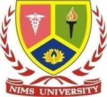

  

# 🖐️ Gesture-Controlled Presentation System  
**A Minor Project by B.Tech CSE Students – 6th Semester**  
🏫 *Nims Institute of Engineering & Technology, NIMS University Rajasthan, Jaipur*  
🔗 [View on GitHub](https://github.com/Aniruddha2701/Gesture-Controlled-Presentation-System)

---

## 🔍 Project Overview

This project introduces an AI-based, contactless system for controlling presentation software through real-time **hand gesture recognition** using a webcam and computer vision.

🎯 **Core Idea:**  
Enable touchless slide navigation, pointer activation, and zooming features using hand gestures—ideal for classrooms, business meetings, and online teaching.

---

## 👨‍💻 Team Members

| Name             | Enrollment No. | Student ID     | Role                          |
|------------------|----------------|----------------|-------------------------------|
| **Aniruddha Maurya** | 137741     | 2022BECSE852   | Project Lead, AI/Backend Logic |
| **Dhanvan Kumar**    | 137792     | 2022BECSE457   | UI/UX, Calibration System     |
| **Anubhav Rai**      | 137750     | 2022BECSE376   | Testing, Data Handling, Docs  |

---

## 🎯 Key Features

✅ Real-time gesture recognition using [MediaPipe](https://google.github.io/mediapipe/)  
✅ Slide navigation (Next, Previous, Play, Pause)  
✅ Zoom and Pointer features through different hand gestures  
✅ Compatible with PowerPoint, Google Slides, and PDF Readers  
✅ Visual gesture feedback & calibration wizard  
✅ Cross-platform support (Windows, macOS, Linux)  
✅ Works with basic 720p webcams  
✅ Personal gesture profile saving and training module

---

## 🗂️ Project Structure

---

## 🛠️ Technologies Used

| Area           | Technologies                      |
|----------------|------------------------------------|
| Language       | Python 3.8+                        |
| CV/AI          | MediaPipe, OpenCV, NumPy, TFLite   |
| UI Framework   | PyQt5 / Tkinter                    |
| Automation     | PyAutoGUI, pygetwindow             |
| OS Control     | win32api (optional)                |
| Storage        | SQLite (for user settings/models) |

---

## 🚀 Installation & Running the App

### ✅ Prerequisites

- Python ≥ 3.8  
- Webcam with 720p resolution or better  
- pip (`python -m ensurepip`)  
- Git (for cloning repo)

---

### ⚙️ Setup (Step-by-step)

